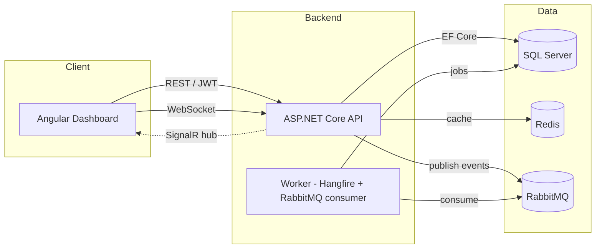

# Accessly

**Real-time event access and ticketing platform built with .NET, C#, Angular, SignalR, SQL Server and Azure-ready infrastructure.**

Accessly helps organizers create events, manage bookings, generate QR code tickets, track live check-ins and automate event access operations from a modern web dashboard.

> Status: active development. The platform is built incrementally; see the [Roadmap](#roadmap) and [CHANGELOG](CHANGELOG.md).

---

## Features

- **Organizations & multi-tenancy** — data is scoped per organization.
- **Role-based access** — `ADMIN`, `ORGANIZER`, `STAFF`, `ATTENDEE`.
- **Event management** — create, edit, publish/unpublish, cancel, manage capacity, venue, categories, speakers and a fictional price.
- **Ticketing (fictional)** — bookings, generated tickets and QR codes, capacity guards.
- **Real-time check-in** — SignalR-powered live dashboard with attendance counts, fill rate and a live feed.
- **Notifications** — confirmation, reminder, change and post-event messages via background jobs (emails are simulated by default).
- **Event assistant** — a provider abstraction with a deterministic offline default that drafts descriptions, tags, reminder emails and agendas.
- **Attendee feedback** — ratings, comments and per-event summaries.
- **Audit logging** — key actions are recorded with actor, entity and metadata.
- **Observability & security** — structured logs, correlation IDs, health checks, metrics, JWT auth, RBAC, rate limiting and validated inputs.

## Tech stack

| Area | Technologies |
| --- | --- |
| Backend | .NET 10, ASP.NET Core Web API, Clean Architecture, CQRS, EF Core, SQL Server |
| Real-time & jobs | SignalR, Hangfire, RabbitMQ, Redis |
| Frontend | Angular, TypeScript, Angular Material, RxJS, Reactive Forms |
| Testing | xUnit, FluentAssertions, Testcontainers, NetArchTest, Playwright |
| DevOps | Docker, Docker Compose, GitHub Actions, Terraform |
| Observability | OpenTelemetry, Prometheus, Grafana |

## Architecture

Accessly follows Clean Architecture: dependencies point inward, the domain has no
infrastructure dependencies, and the application layer orchestrates use cases through a
CQRS dispatcher.



A layered view and detailed diagrams live in [docs/architecture](docs/architecture).

## Repository layout

```
src/
  Accessly.Domain/          Entities, enums, domain rules (no external dependencies)
  Accessly.Application/      Use cases (CQRS), DTOs, validation, abstractions
  Accessly.Infrastructure/   EF Core, providers, messaging, persistence
  Accessly.Api/              ASP.NET Core Web API, SignalR hubs, auth
  Accessly.Worker/           Background jobs and message consumers
  Accessly.Web/              Angular dashboard and public pages
tests/                       Unit, integration, architecture and e2e tests
infra/                       Docker, Azure docs, Terraform, observability
docs/                        Architecture, ADRs, product and security docs
```

## Getting started

### Prerequisites

- [.NET SDK 10](https://dotnet.microsoft.com/download) (`dotnet --version` ≥ 10)
- [Node.js](https://nodejs.org) 20+ and npm
- [Docker](https://www.docker.com/) and Docker Compose

### Run locally

```bash
# 1. Copy environment defaults
cp .env.example .env

# 2. Install dependencies
make setup

# 3. Start the full stack (SQL Server, Redis, RabbitMQ, API, Worker, Web, Prometheus, Grafana)
make docker-up
```

The Docker stack and the full set of make targets are introduced as the project is built
out; see the [Roadmap](#roadmap) for the current state.

## Environment variables

All configuration is provided through environment variables. Copy `.env.example` to `.env`
and adjust values; `.env` is git-ignored and must never be committed. Key groups:

| Variable group | Purpose |
| --- | --- |
| `ConnectionStrings__Default`, `MSSQL_SA_PASSWORD` | SQL Server connection |
| `Jwt__*` | JWT issuer, audience, signing key, lifetime |
| `Redis__*`, `RabbitMq__*` | Cache and messaging |
| `Email__*`, `Ai__*` | Fictional email and the event assistant provider |
| `Cors__AllowedOrigins`, `Seed__Enabled` | API behaviour |

## Make commands

| Command | Description |
| --- | --- |
| `make setup` | Install backend and frontend dependencies |
| `make build` | Build the .NET solution |
| `make dev` | Run the API locally |
| `make test` | Run the .NET test suite |
| `make lint` | Verify C# formatting |
| `make migrate` | Apply EF Core migrations |
| `make seed` | Seed demo data |
| `make docker-up` / `make docker-down` | Start / stop the local stack |
| `make logs` | Tail stack logs |

## Demo data

A development seeder provisions a demo organization, users for each role, sample events,
bookings, tickets, check-ins and feedback so the dashboard is populated on first run. All
demo data is fictional.

## Testing

The solution includes unit tests, integration tests (with Testcontainers), architecture
tests that enforce layer boundaries, frontend unit tests and end-to-end smoke tests.

```bash
make test                 # backend
cd src/Accessly.Web && npm test
```

## CI/CD

GitHub Actions run build, test, architecture checks, frontend lint/test/build, container
builds, security scanning and Terraform validation. Releases are produced from version tags.

## Security

Accessly applies input validation, JWT authentication, role-based authorization, rate
limiting, controlled CORS and security headers. Secrets are never committed. See
[SECURITY.md](SECURITY.md) and [docs/security](docs/security).

## Observability

The API emits structured logs with correlation IDs, exposes health checks and Prometheus
metrics, and is instrumented with OpenTelemetry. Grafana dashboards and Prometheus
configuration ship in [infra/observability](infra/observability).

## Infrastructure

[infra/terraform](infra/terraform) contains an Azure-ready infrastructure example
(resource group, container/app hosting, SQL, Redis, storage). It is an example only and is
never applied automatically.

## Roadmap

Planned enhancements are tracked as GitHub issues, including a Stripe test-mode payment
provider, calendar export, an event recommendation engine, an email provider integration,
advanced seat management and an Azure Container Apps deployment guide.

## What Accessly demonstrates

- ASP.NET Core backend engineering with Clean Architecture and CQRS
- Entity Framework Core and SQL Server data modeling and migrations
- SignalR real-time communication
- Hangfire background jobs and scheduling
- Angular frontend architecture with Angular Material
- Dockerized local development
- CI/CD automation with GitHub Actions
- Infrastructure as Code with Terraform
- Observability with OpenTelemetry, Prometheus and Grafana
- Security practices and automated testing

## License

This project is released under a restrictive license. See [LICENSE](LICENSE).

## Author

Mouhssine Lakhili
