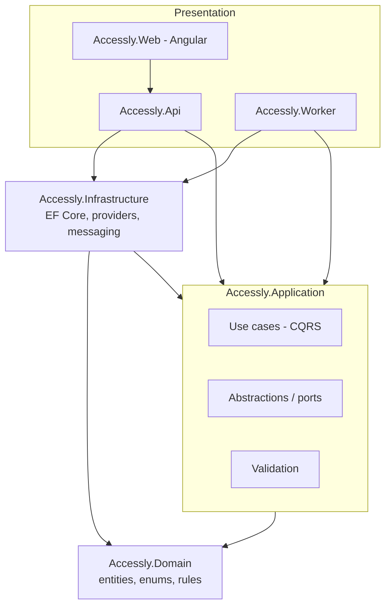
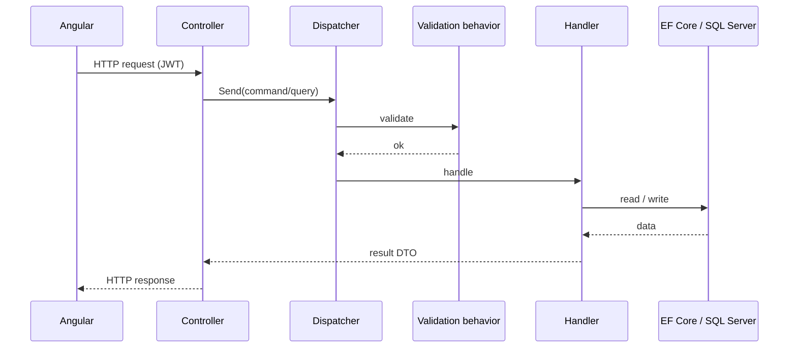

# Architecture overview

Accessly is a modular .NET backend with an Angular frontend, organized around
**Clean Architecture**. Dependencies point inward: the domain is independent, the
application layer orchestrates use cases, and infrastructure and presentation depend on the
inner layers — never the other way around.

## Layers

- **Accessly.Domain** — entities, value objects, enums and invariants. No external dependencies.
- **Accessly.Application** — use cases expressed as commands and queries, DTOs, validators
  and *ports* (interfaces) such as `IAppDbContext`, `IPaymentProvider`, `IAiProvider`,
  `IEmailSender`, `IEventBus`, `ICurrentUser`. Depends only on the domain.
- **Accessly.Infrastructure** — adapters that implement the ports: EF Core persistence,
  JWT/auth, payment/AI/email providers, Redis cache and RabbitMQ messaging.
- **Accessly.Api** — HTTP surface (controllers), authentication, SignalR hubs, Swagger,
  rate limiting and observability.
- **Accessly.Worker** — background processing host (Hangfire server, message consumers).
- **Accessly.Web** — Angular dashboard and public pages.

The dependency rule is enforced automatically by architecture tests (NetArchTest).

## Request flow (CQRS)

Controllers translate HTTP requests into commands/queries that are dispatched through a
lightweight in-process mediator. Cross-cutting concerns (validation, logging) run as
pipeline behaviors around each handler.

See [ADR-001](../adr/ADR-001-clean-architecture.md) and
[ADR-002](../adr/ADR-002-cqrs-application-layer.md) for the rationale.

## Real-time check-in

Staff validate tickets through the API; successful check-ins are persisted and broadcast to
all dashboards connected to the SignalR hub `/hubs/checkins`, updating counts and the live
feed instantly. See [ADR-004](../adr/ADR-004-signalr-realtime-checkin.md).

## Background work and messaging

The API publishes integration events (for example *booking confirmed*, *event cancelled*)
to a message bus. The Worker hosts Hangfire for scheduled and retried jobs (confirmation
emails, 24h reminders, post-event messages) and consumes integration events to fan out
notifications. Messaging is abstracted so a broker outage falls back to in-process handling,
and the same abstraction can target Azure Service Bus.
See [ADR-005](../adr/ADR-005-hangfire-background-jobs.md).

## Data

SQL Server is the system of record, accessed through EF Core with code-first migrations and
a development seeder. Multi-tenancy is logical: rows carry an `OrganizationId` and queries
are scoped by the current organization. See
[ADR-003](../adr/ADR-003-sql-server-entity-framework.md).

## Cross-cutting concerns

- **Security** — JWT authentication, role-based authorization, rate limiting, CORS and
  security headers. See [docs/security](../security).
- **Observability** — structured logs with correlation IDs, health checks, Prometheus
  metrics and OpenTelemetry traces. See [observability.md](observability.md).
