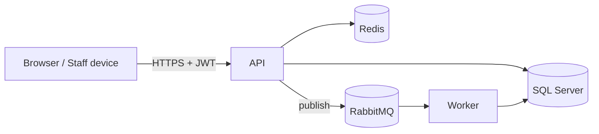

# Threat model

This is a lightweight threat model for Accessly, intended to make the main assets, trust
boundaries and mitigations explicit. It uses STRIDE as a checklist.

## Assets

- Event and booking data (per organization).
- Tickets and QR codes (must not be forgeable or reusable).
- User accounts, credentials and roles.
- Audit logs (integrity matters for accountability).

## Trust boundaries

The primary boundary is between untrusted clients and the API. Datastores and the broker sit
on the trusted side and are not exposed publicly in a real deployment.

## STRIDE summary

| Category | Example threat | Mitigation |
| --- | --- | --- |
| **Spoofing** | Forged identity / token | JWT with signed tokens, short lifetime, server-side validation. |
| **Tampering** | Forged or replayed tickets | Server-generated ticket codes; check-in marks tickets `USED` to prevent reuse; double check-in is rejected. |
| **Repudiation** | Denying an action | Audit logs record actor, entity, action and timestamp. |
| **Information disclosure** | Cross-tenant data access | Logical multi-tenancy: all queries scoped by `OrganizationId`; authorization checks per resource. |
| **Denial of service** | Request flooding | Rate limiting at the API edge; pagination on list endpoints. |
| **Elevation of privilege** | Attendee performing organizer actions | Role-based authorization policies (`ADMIN`, `ORGANIZER`, `STAFF`, `ATTENDEE`). |

## Authentication & authorization

- Passwords are hashed (never stored in plaintext).
- Authentication issues a JWT carrying the user id, organization and role.
- Authorization is policy-based and enforced at the endpoint and, where needed, at the
  resource level (ownership checks).

## Input handling

- All inbound payloads are validated server-side (FluentValidation) before reaching
  handlers.
- Output is returned as DTOs; entities are not serialized directly.

## Secrets

- No secrets are committed. Configuration is supplied via environment variables; only
  `.env.example` (with placeholder values) is tracked.
- CI runs filesystem and secret scanning.

## Out of scope

- Real payment processing and real email delivery (both are simulated by design).
- Handling of sensitive personal data — Accessly only uses fictional demo data.
